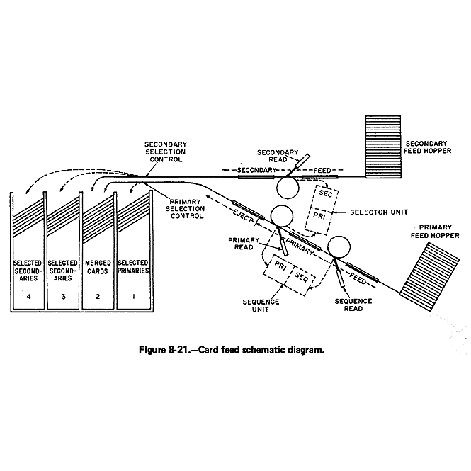
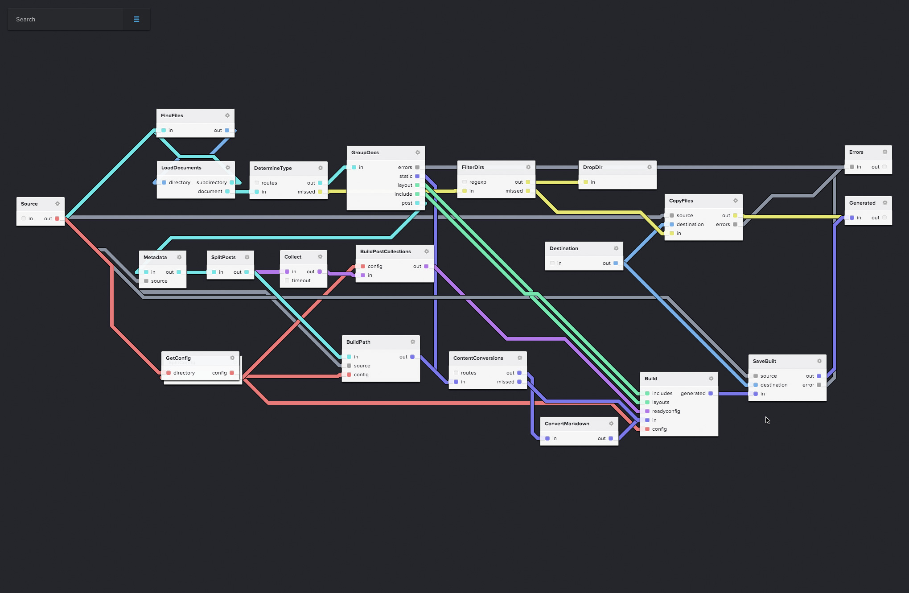
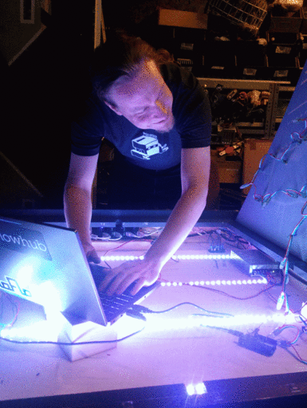

Flow-Based Programming for JavaScript
=====================================

## Call-Return

    var value = someFunction(param);
    // Here we wait until this completes

## Continuation Passing Style

    someFunction(param, function (value) {
      // Our callback gets called once the
      // function completes
    });

## Callback Christmas Tree

    asncFunction1(function(err, result) {
      asncFunction2(function(err, result) {
        asncFunction3(function(err, result) {
          asncFunction4(function(err, result) {
            asncFunction5(function(err, result) {
              // do something useful
            })
          })
        })
      })
    });

> I thought of objects being like biological cells and/or individual computers on a network, only able to communicate with messages

> This is the Unix philosophy: 
Write programs that do one thing and do it well. 
Write programs to work together. 
Write programs to handle text streams, because that is a universal interface.
      
## Unix shell &#8594; FBP in 1D

    $ ps -ef | grep firefox \
      | grep -v grep \
      | awk '{print $2}' \
      | xargs kill -9

* [noflojs.org](http://noflojs.org)
* [flowhub.io](http://flowhub.io)
